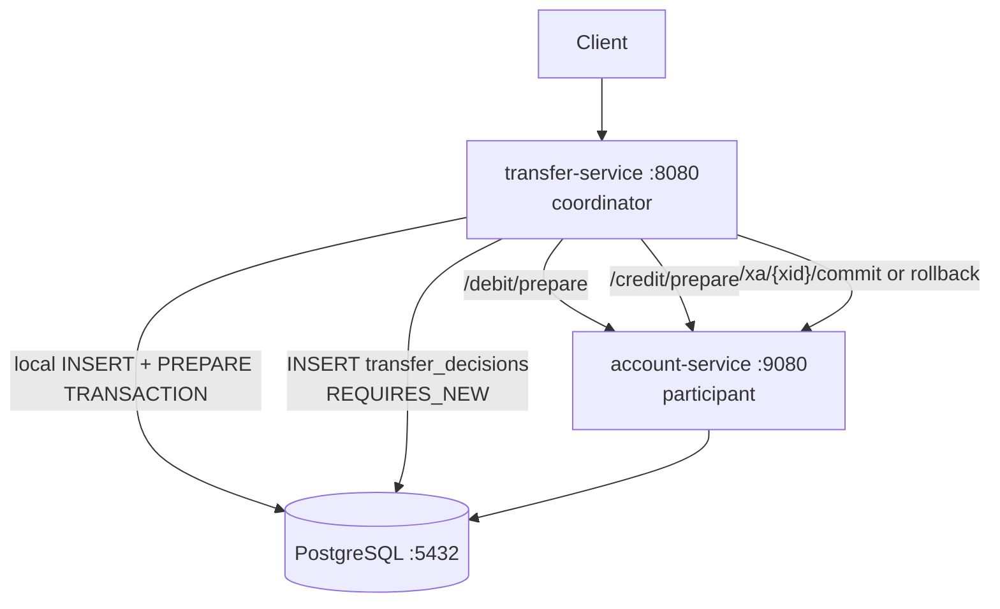

# 3 — Two-phase commit (hand-rolled over PostgreSQL)

This module restores atomicity across services by
hand-rolling a 2-phase commit protocol on top of
PostgreSQL's native `PREPARE TRANSACTION` /
`COMMIT PREPARED` / `ROLLBACK PREPARED` primitives — no
JTA, no XA driver, no third-party transaction manager.

It is the educational counterpoint to the cleaner
asynchronous patterns in modules 4 and 5: 2PC works, but
its operational cost is *visible* in the code.

## What's inside

```
3-two-phase-commit/
├── compose.yaml              # PostgreSQL with max_prepared_transactions=50
├── init-db/init.sql          # Creates "account" and "transfer" schemas
├── account-service/          # Participant, port 9080
│   ├── Dockerfile
│   ├── pom.xml
│   └── src/main/
│       ├── java/.../account/
│       │   ├── AccountController.java     # CRUD + /debit/prepare, /credit/prepare
│       │   ├── XaController.java          # /xa/{xid}/commit, /xa/{xid}/rollback
│       │   ├── AccountService.java        # raw JDBC for PREPARE/COMMIT/ROLLBACK
│       │   └── ...
│       └── resources/
│           ├── application.yaml
│           ├── schema.sql                 # accounts table
│           └── data.sql                   # seed Alice + Bob
└── transfer-service/         # Coordinator + journal participant, port 8080
    ├── Dockerfile
    ├── pom.xml
    └── src/main/
        ├── java/.../transfer/
        │   ├── TransferController.java
        │   ├── TransferCoordinator.java       # drives the 3-participant 2PC
        │   ├── TransferDecisionRepository.java # REQUIRES_NEW durability anchor
        │   └── ...
        └── resources/
            ├── application.yaml
            └── schema.sql                 # transfers + transfer_decisions
```

The transfer-service plays both **coordinator** and
**local participant**. Each transfer drives three
participants:

1. `debit` on the source account (remote).
2. `credit` on the target account (remote).
3. `journal` insert into `transfers` (local, in the
   transfer-service's own database).

`transfer_decisions` is the durability anchor: a row
written via a `REQUIRES_NEW` transaction *before* the
commit phase, recording whether the global outcome is
`COMMIT` or `ABORT`. A coordinator crash after this row
is durable can resume in a known-good state.

## Pedagogical goals

- Show that "atomic across services" is achievable
  without a fancy framework, using PostgreSQL features
  directly.
- Make the cost of 2PC concrete: extra round trips, locks
  held between prepare and commit, an autonomous decision
  table, and explicit recovery code.
- Demonstrate the three classical failure-handling
  responsibilities of a coordinator: prepare, decide,
  finalize.
- Set up the contrast with modules 4 and 5: synchronous
  blocking 2PC versus asynchronous resilience.

## Architecture



The coordinator's order matters and is deliberately
asymmetric:

- **Prepare phase:** prepare remote participants first,
  then the local journal last (last-participant rule —
  avoids holding our own row locked when a remote prepare
  has already failed).
- **Decide:** insert into `transfer_decisions` in its own
  transaction. After this row commits, the global
  outcome is durable even if the coordinator crashes.
- **Commit/rollback phase:** symmetric to the prepare
  order; the local journal is finalized last.

A bonus `ABORTED` row is inserted into `transfers` outside
the protocol if the global decision is `ABORT`, purely so
that `GET /transfers/{id}` is observable.

## Build and run

### Required PostgreSQL configuration

PostgreSQL must be started with
`max_prepared_transactions >= 50`. The module's
`compose.yaml` sets this automatically:

```yaml
postgres:
  image: postgres:17-alpine
  command: postgres -c max_prepared_transactions=50
```

For non-Docker runs, set
`max_prepared_transactions = 50` (or higher) in your
`postgresql.conf` and restart.

### With Docker Compose

```bash
cd 3-two-phase-commit
docker compose up --build
```

Starts PostgreSQL (with 2PC enabled), account-service on
`9080`, transfer-service on `8080`.

### Local Maven build

```bash
cd 3-two-phase-commit/account-service
mvn package -DskipTests
java -jar target/*.jar

# In another terminal
cd 3-two-phase-commit/transfer-service
mvn package -DskipTests
ACCOUNT_SERVICE_URL=http://localhost:9080 \
  java -jar target/*.jar
```

Or build all modules from the repo root:

```bash
task build
```

## API

`transfer-service` (port `8080`):

| Method | Path                  | Behavior                                          |
| ------ | --------------------- | ------------------------------------------------- |
| POST   | `/transfers`          | Synchronous 2PC; `200` on commit, `409` on abort  |
| GET    | `/transfers/{id}`     | Read journaled outcome (`COMMITTED` or `ABORTED`) |

`account-service` (port `9080`):

| Method | Path                              | Behavior                          |
| ------ | --------------------------------- | --------------------------------- |
| POST   | `/accounts`                       | Create an account                 |
| GET    | `/accounts`                       | List all accounts                 |
| GET    | `/accounts/{id}`                  | Get one account                   |
| POST   | `/accounts/{id}/debit/prepare`    | Phase 1 prepare (debit)           |
| POST   | `/accounts/{id}/credit/prepare`   | Phase 1 prepare (credit)          |
| POST   | `/xa/{xid}/commit`                | Phase 2 finalize (commit)         |
| POST   | `/xa/{xid}/rollback`              | Phase 2 finalize (rollback)       |

The prepare endpoints stage the change and run
`PREPARE TRANSACTION` against PostgreSQL, leaving the row
locked until commit/rollback. The xid format is
`transfer-{uuid}-(debit|credit|journal)` and is validated
on the participant side.

## Failure modes and limitations

The protocol restores atomicity but exposes the
operational cost of synchronous 2PC.

- **Locks held between prepare and commit.** A debited
  row stays row-locked until the coordinator finalizes
  it. Slow networks, slow participants, or a stalled
  coordinator amplify lock contention quickly.
- **Coordinator is a single point of failure.** If the
  transfer-service crashes between prepare and commit,
  prepared transactions stay in `pg_prepared_xacts` until
  someone (a human or a recovery process) decides their
  fate based on `transfer_decisions`.
- **In-doubt transactions consume server resources.**
  PostgreSQL's `max_prepared_transactions` is a hard
  cap. A flood of stuck prepared xacts can deny service
  to the entire database.
- **Recovery code is non-trivial.** Idempotent `COMMIT
  PREPARED` / `ROLLBACK PREPARED` (gated on
  `pg_prepared_xacts`) is a tutorial-grade
  approximation. Production would need a recovery scan
  loop, alerting, and operator runbooks.
- **Synchronous and chatty.** Every transfer needs at
  least 2 prepare calls + 2 finalize calls + the local
  journal — and the client waits the full round trip.

Modules 4 and 5 give up the *synchronous* contract on
purpose: they accept that "the transfer is in flight" is
a state the client must tolerate, in exchange for far
better resilience and observability.
