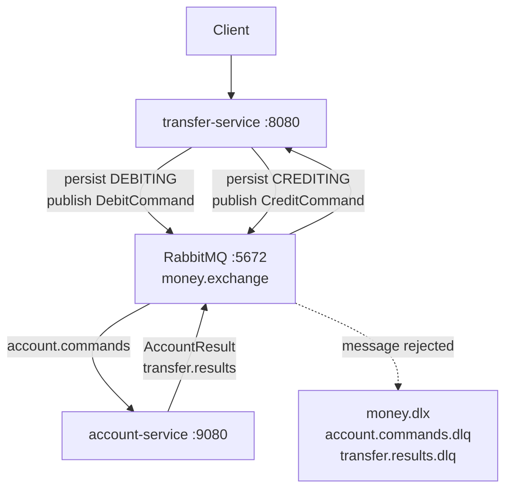

# 4 — Messaging (RabbitMQ + DLQ)

The same money transfer, this time decoupled with
RabbitMQ. The transfer-service publishes commands; the
account-service consumes them and publishes results back.
Failed messages land in a Dead Letter Queue (DLQ) for
inspection and replay.

The architecture trades the synchronous coordinator of
module 3 for asynchronous resilience — but it still has
no automatic compensation, so a failed credit after a
successful debit still leaves money lost (just visibly,
in the DLQ).

## What's inside

```
4-messaging/
├── compose.yaml              # PostgreSQL + RabbitMQ + the two services
├── init-db/init.sql          # Creates "account" and "transfer" schemas
├── account-service/          # Command consumer, port 9080
│   ├── Dockerfile
│   ├── pom.xml
│   └── src/main/
│       ├── java/.../account/
│       │   ├── AccountController.java         # CRUD only (no debit/credit HTTP)
│       │   ├── AccountCommandListener.java    # @RabbitListener on account.commands
│       │   ├── RabbitConfig.java              # exchanges, queues, bindings, DLQ
│       │   └── ...
│       └── resources/
│           ├── application.yaml
│           ├── schema.sql                     # accounts table
│           └── data.sql                       # seed Alice + Bob
└── transfer-service/         # Initiator + result handler, port 8080
    ├── Dockerfile
    ├── pom.xml
    └── src/main/
        ├── java/.../transfer/
        │   ├── TransferController.java
        │   ├── TransferService.java           # initiates, persists, publishes
        │   ├── TransferResultListener.java    # @RabbitListener on transfer.results
        │   ├── RabbitConfig.java              # exchanges, queues, bindings, DLQ
        │   └── ...
        └── resources/
            ├── application.yaml
            └── schema.sql                     # transfers table with status column
```

Two RabbitMQ direct exchanges:

- `money.exchange` — commands and results.
- `money.dlx` — dead-letter exchange.

Two functional queues, each with a dedicated DLQ:

- `account.commands` → `account.commands.dlq`
- `transfer.results` → `transfer.results.dlq`

The `transfers` table tracks state with a four-value
`status` column: `DEBITING` → `CREDITING` →
`COMPLETED`, or `… → FAILED`.

## Pedagogical goals

- Show that asynchronous messaging removes the *coupled
  availability* of synchronous REST or 2PC: the
  transfer-service can keep accepting transfers even
  when the account-service is briefly unreachable.
- Introduce the DLQ as the standard pattern for
  "messages we cannot process": instead of crashing the
  consumer or losing work, the broker parks the failure
  for human inspection.
- Demonstrate the *limits* of plain pub/sub for money:
  the DLQ catches infrastructure failures, but a
  business failure of the credit still loses money
  unless the application implements a compensating
  action.
- Set up module 5: this is exactly the gap a Saga fills.

## Architecture



Per-transfer flow:

1. `POST /transfers` → insert with status `DEBITING` and
   publish `DebitCommand` to `account.commands`.
2. account-service consumes the command, applies the
   debit, publishes a success/failure result to
   `transfer.results`.
3. transfer-service consumes the result. On debit
   success, it transitions to `CREDITING` and publishes
   `CreditCommand`. On debit failure, it transitions to
   `FAILED`.
4. On credit success: `COMPLETED`. On credit failure:
   `FAILED` — and the source remains debited (see
   limitations below).

## Build and run

### With Docker Compose

```bash
cd 4-messaging
docker compose up --build
```

Starts PostgreSQL on `5432`, RabbitMQ on `5672` (with the
management UI on `15672`, `guest`/`guest`),
account-service on `9080`, transfer-service on `8080`.

> **Note for Podman users:** the `compose.yaml` sets
> `user: rabbitmq` on the `rabbitmq:4-management-alpine`
> image so the entrypoint skips the root `chown` + `gosu`
> branch under rootless Podman.

### Local Maven build

```bash
cd 4-messaging/account-service
mvn package -DskipTests
java -jar target/*.jar

# In another terminal
cd 4-messaging/transfer-service
mvn package -DskipTests
java -jar target/*.jar
```

You will need a local PostgreSQL on `localhost:5432` and
a local RabbitMQ on `localhost:5672`. Override
`DB_HOST`, `RABBITMQ_HOST`, etc. as needed.

Or build everything from the repo root:

```bash
task build
```

## API

`transfer-service` (port `8080`):

| Method | Path                | Behavior                                                                |
| ------ | ------------------- | ----------------------------------------------------------------------- |
| POST   | `/transfers`        | Async; `202 Accepted` with `{id, status, message, createdAt, updatedAt}` |
| GET    | `/transfers/{id}`   | Poll for current status (`DEBITING`/`CREDITING`/`COMPLETED`/`FAILED`)   |

`account-service` (port `9080`):

| Method | Path             | Behavior                          |
| ------ | ---------------- | --------------------------------- |
| POST   | `/accounts`      | Create an account                 |
| GET    | `/accounts`      | List all accounts                 |
| GET    | `/accounts/{id}` | Get one account                   |

Note that account-service exposes **no** debit/credit
HTTP endpoints in this module — those operations are
driven exclusively through the RabbitMQ command queue.

```bash
# Initiate a transfer (returns 202 immediately)
curl -i -X POST http://localhost:8080/transfers \
  -H "Content-Type: application/json" \
  -d '{
    "sourceAccountId": "91a12083-e27d-48b8-b67a-b28a8207db8d",
    "targetAccountId": "d2ff0ba8-79c4-4ea7-b297-26847d553d63",
    "amount": 200.00
  }'

# Poll until COMPLETED or FAILED
curl -s http://localhost:8080/transfers/<id> | jq .
```

## Failure modes and limitations

- **No automatic compensation on credit failure.** If the
  credit message is processed and rejected (insufficient
  funds at the target, validation error, persistent 5xx),
  the transfer is marked `FAILED` while the source
  account stays debited. There is no `reverseDebit`
  message published. Money is still lost in the system —
  the DLQ just makes the event observable.
- **DLQ is a parking lot, not a recovery mechanism.**
  Replay is manual. There is no built-in retry policy
  with exponential backoff and a maximum-attempt budget;
  `x-dead-letter-exchange` simply parks failed messages.
- **At-least-once delivery is not handled.** A redelivered
  command (consumer crashed before ack) would re-debit or
  re-credit the same account. There are no idempotency
  keys on the consumer side. Module 5 introduces
  per-`transferId` idempotency slots in the database.
- **Dual-write window.** The transfer-service updates the
  `transfers` table *and* publishes a Rabbit message in
  separate operations. A crash in between can leave the
  row in `CREDITING` with no credit command in flight.
  An outbox pattern would close this gap; the tutorial
  accepts it for clarity.
- **Eventual visibility.** Clients no longer see a
  synchronous outcome. They must poll
  `GET /transfers/{id}` until the status reaches a
  terminal state.

Module 5 closes the compensation gap with a Temporal
Saga: a workflow durably owns the transfer state, retries
activities automatically, and runs a `reverseDebit`
compensation if the credit ultimately fails.
