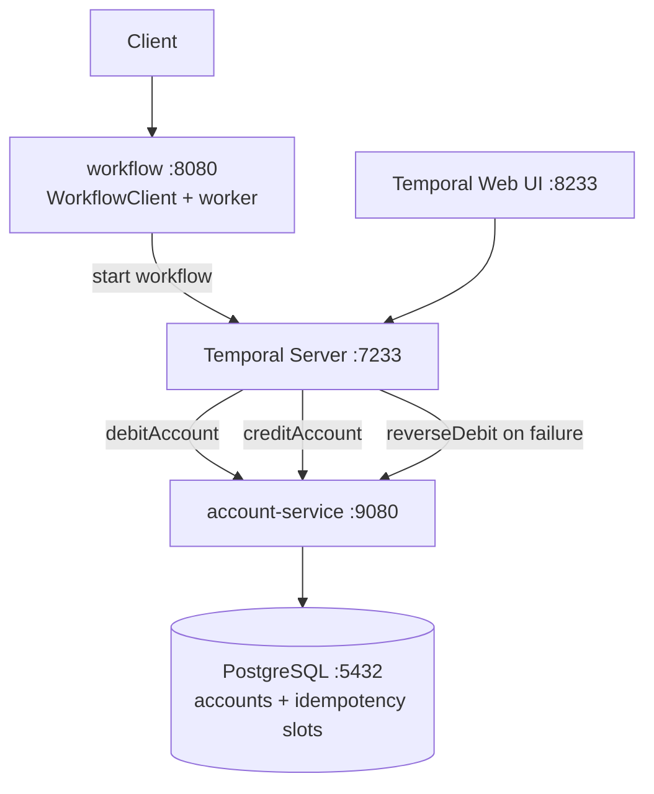

# 5 — Temporal (Saga with automatic compensation)

The destination of the tutorial: a Temporal workflow
orchestrates the transfer, activities call the
account-service, and a Saga compensates the debit if the
credit ultimately fails. Temporal persists the workflow
state — if the workflow service crashes mid-execution, it
resumes from its event history with no completed activity
re-executed.

No money is ever lost, even under crashes, restarts, and
network failures.

## What's inside

```
5-temporal/
├── compose.yaml              # PostgreSQL + Temporal dev server + the two services
├── init-db/init.sql          # Creates "account" schema
├── account-service/          # Idempotent debit/credit/reverse-debit, port 9080
│   ├── Dockerfile
│   ├── pom.xml
│   └── src/main/
│       ├── java/.../account/
│       │   ├── AccountController.java     # /debit, /credit, /reverse-debit
│       │   ├── AccountService.java        # idempotency via (transferId, operation) slot
│       │   └── ...
│       └── resources/
│           ├── application.yaml
│           ├── schema.sql                 # accounts + transfers (idempotency slots)
│           └── data.sql                   # seed Alice + Bob
└── workflow/                 # Temporal workflow + worker, port 8080
    ├── Dockerfile
    ├── pom.xml                            # temporal-spring-boot-starter 1.35.0
    └── src/main/
        ├── java/.../workflow/
        │   ├── TransferController.java    # starts workflows; reads status
        │   ├── TransferWorkflow.java      # @WorkflowInterface
        │   ├── TransferWorkflowImpl.java  # @WorkflowImpl — the Saga
        │   ├── AccountActivities.java     # @ActivityInterface
        │   └── AccountActivitiesImpl.java # @ActivityImpl — REST calls
        └── resources/application.yaml     # workers + task queue config
```

The `workflow` service plays both roles in Temporal terms:
it is a **workflow starter** (HTTP layer) and a **worker**
that hosts the workflow and activity implementations.

The account-service exposes three idempotent endpoints —
`/accounts/{id}/debit`, `/accounts/{id}/credit`, and
`/accounts/{id}/reverse-debit` — all of which insert a
`(transfer_id, operation)` slot into a `transfers` table
in the same `@Transactional` unit as the balance update.
A retried activity finds the slot already taken and
short-circuits without applying the update again.

## Pedagogical goals

- Show what *durable execution* changes about how
  application code is written: orchestration code looks
  almost like a sequential method, while the platform
  handles persistence, retries, and recovery.
- Demonstrate the Saga pattern in practice: register a
  compensation only **after** its activity has actually
  completed (otherwise a failed activity would trigger
  a compensation for work that never happened).
- Demonstrate idempotency at the activity boundary, since
  Temporal activities are at-least-once: the
  account-service de-duplicates retries via a per-
  `(transferId, operation)` slot.
- Make the contrast with module 4 explicit: same
  asynchronous shape, but the workflow can compensate
  automatically and the workflow state is durable
  *outside* the application database.

## Architecture



The Saga shape inside `TransferWorkflowImpl.execute`:

1. Call `debitAccount`. **After** it returns
   successfully, register the `reverseDebit`
   compensation on the Saga.
2. Call `creditAccount`. If it fails, the compensation
   runs in a detached cancellation scope.
3. Compensations use a separate `RetryOptions` policy
   with `maximumAttempts(0)` — unlimited retries — so a
   failed compensation cannot strand the source debited.

Activity retry budget for the *forward* path is bounded
(`maximumAttempts(3)` with a 30s start-to-close
timeout); business failures from the account-service
(HTTP 422 — insufficient funds) are surfaced as a
non-retryable `ApplicationFailure` so the workflow gives
up immediately instead of burning retries on a
deterministic failure.

## Build and run

### With Docker Compose

```bash
cd 5-temporal
docker compose up --build
```

Starts:

- PostgreSQL on `5432`
- Temporal dev server on `7233` (gRPC) and `8233` (Web UI
  at <http://localhost:8233>)
- account-service on `9080`
- workflow on `8080`

The Temporal Web UI shows workflow executions, the full
event history per workflow, retry attempts, and
compensation steps — invaluable for understanding what
the Saga does when something fails.

### Local Maven build

```bash
cd 5-temporal/account-service
mvn package -DskipTests
java -jar target/*.jar

# In another terminal, start a Temporal dev server
temporal server start-dev

# In another terminal
cd 5-temporal/workflow
mvn package -DskipTests
ACCOUNT_SERVICE_URL=http://localhost:9080 \
  TEMPORAL_ADDRESS=localhost:7233 \
  java -jar target/*.jar
```

You'll need the Temporal CLI installed locally. See
<https://docs.temporal.io/cli> for installation.

Or build everything from the repo root:

```bash
task build
```

## API

`workflow` (port `8080`):

| Method | Path                          | Behavior                                                  |
| ------ | ----------------------------- | --------------------------------------------------------- |
| POST   | `/transfers`                  | Async; `202 Accepted` with `{transferId}`. Starts a workflow whose ID is the transferId. |
| GET    | `/transfers/{workflowId}`     | Returns `{workflowId, status}` via `workflowClient.newUntypedWorkflowStub(id).describe()` |

`account-service` (port `9080`):

| Method | Path                              | Behavior                       |
| ------ | --------------------------------- | ------------------------------ |
| POST   | `/accounts`                       | Create an account              |
| GET    | `/accounts`                       | List all accounts              |
| GET    | `/accounts/{id}`                  | Get one account                |
| POST   | `/accounts/{id}/debit`            | Idempotent debit (per `transferId`) |
| POST   | `/accounts/{id}/credit`           | Idempotent credit (per `transferId`) |
| POST   | `/accounts/{id}/reverse-debit`    | Idempotent compensation       |

```bash
# Start a transfer
curl -s -X POST http://localhost:8080/transfers \
  -H "Content-Type: application/json" \
  -d '{
    "sourceAccountId": "91a12083-e27d-48b8-b67a-b28a8207db8d",
    "targetAccountId": "d2ff0ba8-79c4-4ea7-b297-26847d553d63",
    "amount": 200.00
  }' | jq .

# Inspect the running workflow in the Temporal Web UI
open http://localhost:8233
```

## Failure modes and how they are handled

This is the first module where the failure modes have a
correct answer — they are listed here as much for the
*solution* as for the failure.

- **Activity fails transiently (5xx, network blip).**
  Temporal retries automatically up to
  `maximumAttempts(3)` with the configured retry policy.
- **Activity fails permanently (insufficient funds).**
  Surfaced as a non-retryable `ApplicationFailure`
  carrying the type `INSUFFICIENT_FUNDS`. The workflow
  catches `ActivityFailure`, runs no compensation (the
  debit never happened), and ends with
  `status: FAILED`.
- **Credit fails after debit succeeded.** The Saga's
  registered compensation `reverseDebit` runs in a
  detached cancellation scope with unbounded retries
  until the source account is restored.
- **Worker crashes mid-execution.** Temporal persists
  workflow state in its own database. On restart, the
  workflow replays its event history; completed
  activities are not re-run.
- **Activity HTTP response is lost.** Temporal retries
  the call. The account-service idempotency slot
  short-circuits the second attempt so balances are not
  double-applied.

The architectural cost of this resilience is that the
workflow state is owned by Temporal, not by the
application — clients observe outcomes by polling the
workflow status (or by reading the Temporal UI), not by
reading the application's transfers table.
