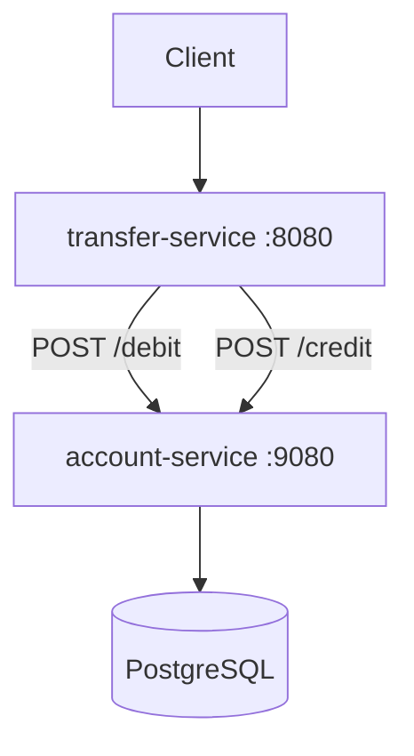
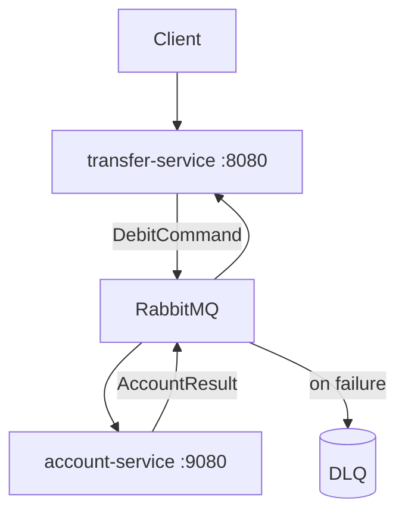
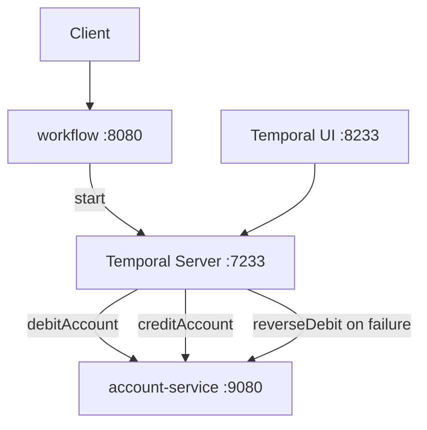

# durable-money

A hands-on tutorial comparing four approaches to building
resilient money transfer systems — from a classic monolith
to durable execution with Temporal. Designed for developers
who want to understand *why* distributed transactions are
hard and *how* Temporal solves the problem.

[](LICENSE)

## Features

- **Progressive complexity** — each module builds on the
  previous one, introducing a new failure mode and its
  solution.
- **Same domain, four architectures** — money transfer is
  implemented identically in all four modules so the
  differences are easy to spot.
- **Runnable with one command** — every module ships with
  a `compose.yaml` that starts all required services.
- **Teaching comments** — key trade-offs are highlighted
  inline in the source code.
- **Modern stack** — Spring Boot 4.0.5, Java 25, PostgreSQL
  17, RabbitMQ 4, Temporal.

## Prerequisites

- Docker and Docker Compose
- Java 25 and Maven (for local development only)

## Modules

Each module is fully independent — no shared code, no
parent POM. Navigate into any numbered directory and run
`docker compose up --build` to start it.

| Module                | Approach                   | Key concept                             |
| --------------------- | -------------------------- | --------------------------------------- |
| `1-monolith`          | Monolith + ACID            | Single `@Transactional` covers everything |
| `2-microservices`     | REST microservices         | Distributed calls without a safety net  |
| `3-two-phase-commit`  | 2PC + Postgres prepared tx | Hand-rolled 2-phase commit, no JTA      |
| `4-messaging`         | RabbitMQ + DLQ             | Async resilience, still no compensation |
| `5-temporal`          | Temporal + Saga            | Durable execution with auto-compensation|

## Getting Started

Clone the repo and choose a module to explore:

```bash
git clone <repo-url>
cd durable-money
```

Start a module:

```bash
cd 1-monolith
docker compose up --build
```

The API is available at `http://localhost:8080`.

## Usage

### Pre-loaded demo accounts

All four modules ship the same `data.sql` seed, so the
following two accounts exist on startup in every module
and the same source/target IDs work everywhere:

| Owner | Account ID                             | Initial balance |
| ----- | -------------------------------------- | --------------- |
| Alice | `91a12083-e27d-48b8-b67a-b28a8207db8d` | 1000.00         |
| Bob   | `d2ff0ba8-79c4-4ea7-b297-26847d553d63` | 100.00          |

```bash
# Transfer 200.00 from Alice to Bob (works on all modules)
curl -s -X POST http://localhost:8080/transfers \
  -H "Content-Type: application/json" \
  -d '{
    "sourceAccountId": "91a12083-e27d-48b8-b67a-b28a8207db8d",
    "targetAccountId": "d2ff0ba8-79c4-4ea7-b297-26847d553d63",
    "amount": 200.00
  }' | jq .
```

Listing accounts is only exposed by module 1:

```bash
# List the seeded accounts (module 1 only)
curl -s http://localhost:8080/accounts | jq .
```

### Create your own accounts

```bash
# Create source account
curl -s -X POST http://localhost:8080/accounts \
  -H "Content-Type: application/json" \
  -d '{"owner": "Carol", "initialBalance": 500.00}' | jq .

# Create target account
curl -s -X POST http://localhost:8080/accounts \
  -H "Content-Type: application/json" \
  -d '{"owner": "Dave", "initialBalance": 50.00}' | jq .
```

### Transfer responses across modules

The `POST /transfers` request body is identical in every
module, but the response body and HTTP status evolve as
the architecture moves from synchronous-atomic to
asynchronous-durable:

| Module               | Status       | Response body                                              |
| -------------------- | ------------ | ---------------------------------------------------------- |
| 1-monolith           | 200 OK       | full Transfer (`id`, accounts, `amount`, `createdAt`, `completedAt`) — synchronous, atomic |
| 2-microservices      | 200 OK       | `{transferId, status, message}` — synchronous, may leave money lost on failure |
| 3-two-phase-commit   | 200 OK       | full Transfer (atomic via 2PC) — synchronous, all-or-nothing across services |
| 4-messaging          | 202 Accepted | `{id, status, message, createdAt, updatedAt}` — async, poll `GET /transfers/{id}` |
| 5-temporal           | 202 Accepted | `{transferId}` — async via Temporal; observe in the UI or `GET /transfers/{workflowId}` |

### Module 5 — Temporal UI

When running module 5, the Temporal Web UI is available
at `http://localhost:8233`. It shows workflow executions,
event history, and compensation steps in real time.

## Architecture

### Module 1 — Monolith (ACID)

```mermaid
graph TD
    Client --> App
    App -->|@Transactional| DB[(PostgreSQL)]
```

A single service handles everything. The debit and credit
happen inside one database transaction — if either fails,
both roll back automatically.

### Module 2 — Microservices (no safety net)



Two services communicate over REST. If the credit call
fails after the debit succeeds, money disappears from
the system — there is no distributed transaction to roll
back the debit.

### Module 3-two-phase-commit — Two-phase commit (PostgreSQL prepared transactions)

```mermaid
graph TD
    Client --> Transfer[transfer-service :8080]
    Transfer -->|/debit/prepare| Account[account-service :9080]
    Transfer -->|/credit/prepare| Account
    Transfer -->|local PREPARE TRANSACTION journal| DB[(PostgreSQL)]
    Transfer -->|INSERT transfer_decisions| DB
    Transfer -->|/xa/{xid}/commit or rollback| Account
    Account --> DB
```

The transfer-service plays both **coordinator** and **participant**.
It drives a 3-participant 2-phase commit (debit, credit, journal)
using PostgreSQL's native `PREPARE TRANSACTION` /
`COMMIT PREPARED` / `ROLLBACK PREPARED` primitives. Coordinator
durability is anchored by an autonomous insert into
`transfer_decisions` before the commit phase. The protocol restores
atomicity but exposes its operational cost: the debited row stays
locked between prepare and commit, and the coordinator becomes a
single point of failure that motivates the asynchronous patterns in
modules 4 and 5.

### Module 4 — Messaging (RabbitMQ + DLQ)



Services communicate asynchronously via RabbitMQ. Failed
messages are routed to a Dead Letter Queue for inspection
and replay. The credit step still has no automatic
compensation if it fails after a successful debit.

### Module 5 — Temporal (Saga pattern)



Temporal persists workflow state durably. Activities are
retried automatically on failure. If the credit fails
after the debit succeeds, the Saga compensates by
reversing the debit — no money is ever lost, even if
the workflow service crashes mid-execution.

## Configuration

Each module reads its configuration from environment
variables with sensible defaults for local development.

| Variable              | Description                       | Default              |
| --------------------- | --------------------------------- | -------------------- |
| `DB_HOST`             | PostgreSQL hostname               | `localhost`          |
| `DB_USER`             | PostgreSQL username               | `demo`               |
| `DB_PASS`             | PostgreSQL password               | `demo`               |
| `ACCOUNT_SERVICE_URL` | Account service base URL (2, 3, 5)| `http://localhost:9080` |
| `RABBITMQ_HOST`       | RabbitMQ hostname (4)             | `localhost`          |
| `TEMPORAL_ADDRESS`    | Temporal Server address (5)       | `localhost:7233`     |

> **Note for module `3-two-phase-commit`:** PostgreSQL must be started with
> `max_prepared_transactions >= 50` for `PREPARE TRANSACTION`
> to work. The module's `compose.yaml` sets this automatically
> via `command:`; for non-Docker runs the operator must enable
> it manually in `postgresql.conf`.

## License

This project is licensed under the Apache-2.0 License —
see [LICENSE](LICENSE) for details.
